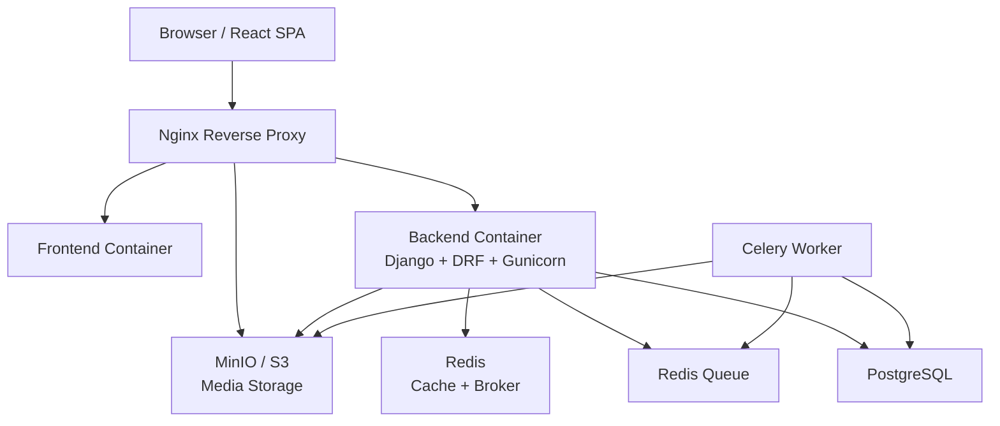

# 🎵 Music Stream App


A full-stack, dockerized music streaming application built as a professional
portfolio project.

The project demonstrates real-world backend development, frontend development,
Docker, testing, CI/CD, production hardening, caching, background jobs, object
storage, and deployment preparation.

---

## ✨ Features

- [x] User registration
- [x] JWT login and token refresh
- [x] Protected routes on the frontend
- [x] Upload songs
- [x] Stream/play songs
- [x] HTTP Range request support for seeking audio
- [x] Song list and search
- [x] Public feed
- [x] User profile page
- [x] Public user profile pages
- [x] Background audio processing with Celery
- [x] Audio metadata extraction
- [x] Object storage with MinIO locally and S3-compatible storage in production
- [x] PostgreSQL database
- [x] Redis cache and Celery broker
- [x] Dockerized development environment
- [x] Dockerized production-like environment
- [x] Nginx reverse proxy
- [x] OpenAPI schema, Swagger UI, and Redoc
- [x] Versioned REST API under `/api/v1/`
- [x] Automated backend tests with pytest
- [x] Automated frontend tests with Vitest and React Testing Library
- [x] GitHub Actions CI
- [x] Environment and secrets management
- [x] Production smoke test script
- [x] Security pass: CORS, headers, rate limiting
- [x] Performance pass: query optimization and caching
- [x] Documentation polish with architecture diagrams
- [x] VPS setup preparation: server hardening, Docker, firewall
- [x] Manual VPS deployment (HTTP, port 80)
- [x] Live VPS deployment
- [x] Domain + HTTPS (Let's Encrypt + HAProxy SNI)
- [x] CI/CD auto-deploy with GitHub Actions
- [x] Structured JSON logging with request ID tracing
- [x] Database and media backups
- [x] Backup retention policy: 7 daily + 4 weekly backups
- [x] Optional offsite backup scripts for S3-compatible storage and manual rsync over SSH
- [ ] Playlists
- [ ] Favorite/liked songs

---

## 🛠️ Tech Stack

| Layer | Technology |
|---|---|
| Backend | Django, Django REST Framework |
| Frontend | React, TypeScript, Vite |
| API Client | Axios |
| Routing | React Router |
| Frontend State / Data | React Context, TanStack Query |
| Database | PostgreSQL |
| Cache | Redis |
| Background Jobs | Celery |
| Broker | Redis |
| Storage | MinIO locally, S3-compatible storage in production |
| Backups | pg_dump, MinIO Client, tar/gzip, sha256 |
| Backup Scheduling | systemd timer |
| Offsite Backup Options | S3-compatible upload, manual rsync over SSH |
| Reverse Proxy | Nginx |
| Authentication | JWT with SimpleJWT |
| API Docs | drf-spectacular, OpenAPI, Swagger, Redoc |
| Testing | pytest, pytest-cov, Vitest, React Testing Library |
| Linting / Formatting | Ruff, ESLint, Prettier |
| Containerization | Docker, Docker Compose |
| CI/CD | GitHub Actions |
| Metrics | Prometheus, django-prometheus |
| Dashboards | Grafana |
| Exporters | node_exporter, cAdvisor |
| Logging | Structured JSON with request ID tracing |
| Deployment Target | VPS first, cloud later |

---

## 📐 Architecture



Nginx is the public entrypoint. It routes frontend requests, API requests, and
media streaming requests. Backend services such as PostgreSQL, Redis, Celery,
and MinIO are internal services in the Docker network.

For the full architecture documentation, see:

👉 [`docs/ARCHITECTURE.md`](./docs/ARCHITECTURE.md)

---

## 🔁 Main Request Flows

### Authentication

```text
Browser
  → Nginx
  → Django API
  → Redis throttle check
  → PostgreSQL user verification
  → JWT access + refresh tokens
```

### Song Upload

```text
Browser
  → Nginx
  → Django API
  → MinIO/S3 stores audio file
  → PostgreSQL stores song row
  → Celery task is queued
  → Celery extracts metadata
```

### Song Streaming

```text
Browser audio player
  → Nginx
  → MinIO/S3 media object
  → HTTP 200 / 206 response
```

### Cached Feed

```text
GET /api/v1/feed/
  → Check Redis cache
  → If hit: return cached response
  → If miss: query PostgreSQL, cache response, return response
```

---

## 📁 Project Structure

```text
music-stream-app/
├── backend/
│   ├── config/
│   │   ├── settings/
│   │   │   ├── base.py
│   │   │   ├── dev.py
│   │   │   ├── ci.py
│   │   │   └── production.py
│   │   ├── urls.py
│   │   └── celery.py
│   ├── music/
│   │   ├── models.py
│   │   ├── serializers.py
│   │   ├── views.py
│   │   ├── tasks.py
│   │   ├── throttles.py
│   │   └── tests/
│   ├── Dockerfile
│   ├── pyproject.toml
│   └── README.md
├── frontend/
│   ├── src/
│   │   ├── api/
│   │   ├── components/
│   │   ├── context/
│   │   ├── hooks/
│   │   ├── pages/
│   │   ├── routes/
│   │   ├── types/
│   │   └── utils/
│   ├── Dockerfile
│   ├── package.json
│   └── README.md
├── nginx/
│   ├── disabled/
|   |   └── default.conf
|   ├── app-ssl.conf.template
|   └── nginx.conf
├── monitoring/
│   ├── prometheus/
│   │   ├── prometheus.yml
│   │   └── rules/
│   │       └── alerts.yml
│   └── grafana/
│       ├── provisioning/
│       │   ├── datasources/
│       │   │   └── prometheus.yml
│       │   └── dashboards/
│       │       └── dashboards.yml
│       └── dashboards/
│           └── app-overview.json
├── scripts/
│   ├── backup/
│   │   ├── backup.sh
│   │   ├── backup-db.sh
│   │   ├── backup-media.sh
│   │   ├── restore-db.sh
│   │   ├── restore-media.sh
│   │   ├── prune.sh
│   │   ├── upload-remote.sh
│   │   ├── upload-rsync.sh
│   │   └── lib.sh
│   ├── ops/
│   │   ├── install-backups.sh
│   │   └── https-time-sync.sh
│   ├── check-env.sh
│   ├── deploy.sh
│   ├── generate-secrets.sh
│   ├── server-setup.sh
│   ├── smoke-prod.sh
│   ├── vps-prepare-https.sh
│   ├── vps-issue-cert-standalone.sh
│   ├── cloud/
│   │   └── s3-smoke.sh.sh
├── docs/
│   ├── ARCHITECTURE.md
│   ├── deployment.md
│   ├── https-haproxy.md
│   ├── env-management.md
│   ├── monitoring.md
│   ├── performance.md
│   ├── security.md
│   ├── smoke-tests.md
│   ├── backups.md
│   ├── operations.md
│   ├── cloud-migration.md
│   └── JOURNAL.md
├── backups/
│   └── .gitignore
├── docker-compose.yml
├── docker-compose.dev.yml
├── docker-compose.prod.yml
├── docker-compose.vps.yml
├── docker-compose.monitoring.yml
├── Makefile
└── README.md
```

---

## 🚀 Quick Start — Development

### 1. Clone the project

```bash
git clone https://github.com/Rasoulsa/music-stream-app.git
cd music-stream-app
```

### 2. Create local environment files

The Docker development stack uses `.env.dev`.

```bash
cp .env.dev.example .env.dev
```

Optional: if you also want a generic local `.env` file, create it from the
example:

```bash
cp .env.example .env
```

Optional: if you want to run the frontend directly with `npm run dev`, create a
frontend env file too:

```bash
cp frontend/.env.example frontend/.env
```

Edit the files if needed.

### 3. Start the development stack

```bash
make dev-up-d
```

### 4. Run migrations

```bash
make dev-migrate
```

### 5. Create a superuser, optional

```bash
make dev-createsuperuser
```

### 6. Open the app

Depending on your Docker Compose port configuration:

| Service | URL |
|---|---|
| Frontend | `http://localhost:5173` |
| Backend health | `http://localhost:8000/api/health/` |
| Swagger UI | `http://localhost:8000/api/docs/` |
| Redoc | `http://localhost:8000/api/redoc/` |
| MinIO Console | local development only, if exposed |

---

## 🏭 Production-like Local Stack

The production-like stack runs behind Nginx and uses production settings.

### 1. Prepare production env

The production-like Docker stack uses `.env.prod`.

```bash
cp .env.prod.example .env.prod
```

Generate strong secrets:

```bash
make secrets
```

Paste the generated values into `.env.prod`.

### 2. Validate environment

```bash
make check-env
```

### 3. Start production stack

```bash
make prod-up
```

### 4. Check services

```bash
make prod-ps
```

### 5. Run production smoke test

```bash
make smoke-prod
```

Expected result:

```text
Results: 52 passed, 0 failed
```

### 6. Run a local backup

Once the production-like stack is running, backups can be tested locally:

```bash
make backup
make backup-list
```

This creates compressed, checksummed database and media backups under:

```text
./backups/
```

The backup directory is git-ignored except for `backups/.gitignore`.

---

## 🚢 Deployment

See [`docs/deployment.md`](./docs/deployment.md) for VPS setup and deployment
steps.

Phase 5, Deployment & Cloud, is in progress:

- ✅ Day 38 — VPS setup: server hardening, Docker, firewall
- ✅ Day 39 — Manual VPS deploy
- ✅ Day 40 — Domain + HTTPS (Let's Encrypt + HAProxy SNI) — [`docs/https-haproxy.md`](./docs/https-haproxy.md)
- ✅ Day 41 — CI/CD auto-deploy to VPS
- ✅ Day 42 — Monitoring and logging basics
- ✅ Day 43 — Database and media backups
- ✅ Day 44 — AWS/cloud migration intro

The deployment plan starts with a VPS-based production environment and later
moves toward cloud deployment concepts such as managed storage, managed
databases, monitoring, and automated delivery.

### CI/CD Pipeline

Every push to `main` automatically:
Push to main → Test (pytest) → Deploy (SSH + git reset + scripts/deploy.sh) → Verify (HTTPS health)
All deploy logic lives in `scripts/deploy.sh`, which is called identically by
both manual SSH sessions and automated CI runs. See
[`docs/cicd-deploy.md`](./docs/cicd-deploy.md) for details.

---

## 🧪 Testing

### Backend tests

Run backend tests locally against the disposable test database:

```bash
make test-backend
```

Run backend tests with coverage:

```bash
make test-backend-cov
```

Run backend performance tests:

```bash
make test-backend-perf
```

Run tests inside the development Docker stack:

```bash
make dev-test
make dev-test-cov
```

---

### Frontend tests

```bash
cd frontend
npm install
npm test
```

Build the frontend:

```bash
npm run build
```

Run linting:

```bash
npm run lint
```

---

## 📚 API Reference

The API is versioned under:

```text
/api/v1/
```

The health check is intentionally unversioned:

```text
/api/health/
```

This keeps Docker and Nginx health checks stable even if the API version changes.

---

### Auth endpoints

| Method | Endpoint | Purpose |
|---|---|---|
| `POST` | `/api/v1/auth/register/` | Register a new user |
| `POST` | `/api/v1/auth/login/` | Login and receive JWT tokens |
| `POST` | `/api/v1/auth/refresh/` | Refresh JWT access token |

---

### User endpoints

| Method | Endpoint | Purpose |
|---|---|---|
| `GET` / `PATCH` | `/api/v1/users/me/` | Current user profile |
| `GET` | `/api/v1/users/<username>/` | Public user profile |
| `GET` | `/api/v1/users/<username>/songs/` | Public songs by user |

---

### Song endpoints

| Method | Endpoint | Purpose |
|---|---|---|
| `GET` | `/api/v1/songs/` | List public songs |
| `POST` | `/api/v1/songs/` | Upload a song |
| `GET` | `/api/v1/songs/<id>/` | Retrieve a song |
| `PATCH` | `/api/v1/songs/<id>/` | Update a song |
| `DELETE` | `/api/v1/songs/<id>/` | Delete a song |
| `GET` | `/api/v1/songs/mine/` | List current user's songs |
| `GET` | `/api/v1/feed/` | Public cached feed |

---

### API documentation endpoints

| Endpoint | Purpose |
|---|---|
| `/api/schema/` | OpenAPI schema |
| `/api/docs/` | Swagger UI |
| `/api/redoc/` | Redoc UI |

---

## 🔐 Security Highlights

Security work is documented in:

👉 [`docs/security.md`](./docs/security.md)

Implemented items include:

- `DEBUG=False` in production
- Environment-based secrets
- Git-ignored real env files
- Example env files committed safely
- CORS configuration
- Security headers
- Hidden Nginx version
- JWT authentication
- Login rate limiting
- Registration/upload throttling
- MinIO console not exposed in production
- Production smoke test checks for headers and exposed ports
- VPS setup preparation with firewall and server hardening

---

## ⚡ Performance Highlights

Performance work is documented in:

👉 [`docs/performance.md`](./docs/performance.md)

Implemented items include:

- Feed query optimization
- Redis feed caching
- Database index for public recent songs
- API feed response target under 500ms
- Gzip compression for API responses
- Performance smoke test checks

---

## 📊 Observability

Observability work is documented in:

👉 [`docs/monitoring.md`](./docs/monitoring.md)

The app ships a lightweight, VPS-friendly observability stack based on
Prometheus and Grafana, plus structured logging.

### Metrics

- App metrics via `django-prometheus` (request rate, latency, status codes)
- Host metrics via `node_exporter` (CPU, RAM, disk)
- Per-container metrics via `cAdvisor`
- Prometheus scrapes all targets every 15s and stores time-series
- Grafana dashboards provisioned as code (datasource + overview dashboard)

### Logging

- Structured single-line JSON logs in production
- Per-request `X-Request-ID` tracing across logs and response headers
- Docker `json-file` log rotation (10MB × 3 files per container)

### Health / readiness

`GET /api/health/` is a readiness check that verifies the database and cache.
It returns `200` when healthy and `503` when degraded, so load balancers and
uptime monitors can react correctly.

### Alerting

Prometheus alert rules cover:

- Target down (scrape failure)
- High HTTP 5xx rate
- High disk usage
- High memory usage

### Security

Monitoring is never exposed publicly:

- Prometheus (`:9090`) and Grafana (`:3000`) bind to `127.0.0.1` only
- Accessed via SSH tunnel
- `/metrics` returns `404` at the public Nginx edge

### Usage

```bash
# Start app + monitoring stack
make monitoring-up

# Access Grafana via SSH tunnel, then open http://localhost:3000
ssh -L 3000:localhost:3000 <vps-user>@<vps-host>

# Access Prometheus via SSH tunnel, then open http://localhost:9090
ssh -L 9090:localhost:9090 <vps-user>@<vps-host>
```

### Operational note: time synchronization in restricted networks

This deployment expects the server clock to be reasonably accurate for TLS,
logs, Prometheus, Grafana, and CI/CD verification.

Normally, time synchronization should be handled by NTP/Chrony. However, in some
restricted networks, NTP may fail because UDP/123 traffic is blocked. For that
case, the project includes an optional HTTPS-based fallback time sync runner.

See:
- [Fallback HTTPS Time Synchronization](docs/operations.md#fallback-https-time-synchronization)

Quick install/update:

```bash
sudo bash scripts/ops/https-time-sync.sh install
```

> This fallback uses HTTPS `Date` headers over TCP/443 and is not a full
> replacement for proper NTP.

---

## 💾 Backups and Disaster Recovery

Backup and restore procedures are documented in:

👉 [`docs/backups.md`](./docs/backups.md)

The project includes a production-style backup system for both PostgreSQL data
and uploaded media objects.

### What is backed up?

| Data | Method |
|---|---|
| PostgreSQL database | `pg_dump` custom format, gzip compressed |
| Media files | MinIO/S3 bucket mirrored with `mc`, archived with `tar.gz` |

### Backup features

- Full backup command for database + media
- Database-only and media-only backup commands
- SHA256 checksum generation for every artifact
- Gzip integrity verification
- Retention policy:
  - keep 7 daily backups
  - keep 4 weekly backups
- Backup pruning for old artifacts
- Latest backup symlinks for convenience
- Restore scripts with confirmation prompts to prevent accidental overwrite
- systemd timer installer for daily scheduled backups on VPS
- Optional offsite upload script for S3-compatible storage
- Optional manual rsync script for pushing backups to a secondary VPS

### Backup commands

```bash
# Full backup: database + media
make backup

# Database only
make backup-db

# Media only
make backup-media

# List local backup artifacts
make backup-list
```

### Restore commands

```bash
# Restore database from a backup artifact
make restore-db FILE=backups/db/daily/db-YYYYMMDD-HHMMSS.dump.gz

# Restore media from a backup artifact
make restore-media FILE=backups/media/daily/media-YYYYMMDD-HHMMSS.tar.gz
```

Restore scripts require explicit confirmation before overwriting data.

### Backup storage location

**By default, backups are stored under:**

```text
./backups/
```

The location can be changed with:

```ini
BACKUP_ROOT=/opt/backups/music-stream-app
```

This allows the same scripts to write backups to a different disk, mounted
volume, or server path.

### Offsite backup options

The project supports optional offsite strategies.

**Option A — S3-compatible storage**

Handled by:
```text
scripts/backup/upload-remote.sh
```

This is disabled by default and can be enabled later with real S3-compatible
credentials.

Example configuration:

```routeros
BACKUP_REMOTE_UPLOAD=true
BACKUP_S3_BUCKET=my-offsite-backup-bucket
BACKUP_S3_ENDPOINT=
```

For AWS S3, `BACKUP_S3_ENDPOINT` can be empty.

**Option B — Manual rsync to another VPS**

Handled by:

```text
scripts/backup/upload-rsync.sh
```

This script is intentionally ***manual only***. It is not executed automatically
on every backup.

Run it with:

```bash
make backup-rsync
```

Example configuration:

```ini
BACKUP_RSYNC_HOST=deploy@backup.example.com
BACKUP_RSYNC_PATH=/opt/backups/music-stream-app
BACKUP_RSYNC_KEY=/home/deploy/.ssh/backup_key
```

This is useful when using a second VPS as a simple offsite backup target.

### Scheduling on VPS

Daily scheduled backups can be installed with:

```bash
make backups-install
```

Check timer status and recent backup logs:

```bash
make backups-status
```

The scheduling uses a systemd timer instead of cron, with persistent execution
support for missed runs.

### Local verification performed

The backup implementation has been verified locally with:

- successful database backup
- successful media backup from MinIO bucket music-media
- backup listing
- tar archive inspection
- SHA256 checksum verification for database artifacts
- SHA256 checksum verification for media artifacts

---

## ☁️ Cloud Migration Readiness (AWS)

Cloud migration strategy is documented in:

👉 [`docs/cloud-migration.md`](./docs/cloud-migration.md)

The application is **cloud-ready by design**. The stateful, hardest-to-migrate
layers use standard, portable interfaces:

| Current (self-hosted) | AWS managed equivalent | Migration effort |
|---|---|---|
| MinIO (S3-compatible) | Amazon S3 | Config only |
| PostgreSQL | Amazon RDS | Dump + restore |
| Redis | Amazon ElastiCache | Config only |
| Docker Compose | ECS Fargate | IaC (biggest lift) |
| Nginx / Let's Encrypt | ALB + CloudFront + ACM | Rework routing |

### Proven: S3 compatibility

Because the storage layer uses the S3 API (`django-storages`), the same
application code works against **both MinIO and real AWS S3** — only environment
variables change. This is validated by a smoke test:

```bash
make s3-smoke
```

It uploads, lists, downloads, verifies, and deletes a test object using the
same S3 API the app uses. It can target MinIO locally or real AWS S3 with
credentials.

### Database migration reuses backups

The `pg_dump` artifacts produced by `make backup-db` restore directly into an
RDS PostgreSQL instance — the backup system doubles as a migration tool.

### Recommended migration order

```text
1. Storage  → S3           (config only, reversible)  ← easiest
2. Cache    → ElastiCache  (config only)
3. Database → RDS          (dump/restore)
4. Compute  → ECS Fargate  (IaC)                       ← hardest
```

Migrate stateful, portable layers first; migrate compute orchestration last.

---

## ✅ Production Smoke Test

The production smoke test validates the full stack:

```bash
make smoke-prod
```

It checks:

- Container health
- Nginx health
- Backend health
- Frontend HTML
- OpenAPI docs
- Auth flow
- JWT login and refresh
- Song upload
- Song retrieval
- Song streaming
- HTTP Range requests
- MinIO internal health
- Security headers
- Environment/secrets setup
- Rate limiting
- Feed performance
- Gzip compression

Documentation:

👉 [`docs/smoke-tests.md`](./docs/smoke-tests.md)

---

## 🧰 Useful Make Commands

```bash
make help
```

Common commands:

| Command | Purpose |
|---|---|
| `make dev-up-d` | Start dev stack in background |
| `make dev-down` | Stop dev stack |
| `make dev-logs` | Follow all dev logs |
| `make dev-migrate` | Run dev migrations |
| `make dev-test-cov` | Run backend tests with coverage in dev |
| `make prod-up` | Start production-like stack |
| `make prod-down` | Stop production-like stack |
| `make prod-logs` | Follow production logs |
| `make prod-check` | Run Django production checks |
| `make check-env` | Validate `.env.prod` |
| `make secrets` | Generate production secrets |
| `make smoke-prod` | Run production smoke test |
| `make test-backend-cov` | Run local backend coverage tests |
| `make test-backend-perf` | Run backend performance tests |
| `make schema-freeze` | Regenerate frozen OpenAPI schema |
| `make schema-check` | Check live schema against frozen schema |
| `make vps-config` | Render merged VPS Compose config |
| `make vps-up` | Start VPS HTTPS stack |
| `make vps-prepare-https` | VPS: install certbot, create dirs, renewal hook |
| `make vps-issue-cert` | VPS: issue initial Let's Encrypt certificate |
| `make monitoring-up` | Start app + monitoring stack (Prometheus, Grafana) |
| `make monitoring-down` | Stop monitoring containers only (keeps app running) |
| `make monitoring-ps` | Show monitoring container status |
| `make monitoring-logs` | Follow monitoring stack logs |
| `make monitoring-reload` | Hot-reload Prometheus config |
| `make backup` | Run full backup: database + media |
| `make backup-db` | Backup PostgreSQL database only |
| `make backup-media` | Backup media bucket only |
| `make backup-list` | List existing local backups |
| `make restore-db FILE=<path>` | Restore database from backup file |
| `make restore-media FILE=<path>` | Restore media from backup file |
| `make backups-install` | Install daily systemd backup timer on VPS |
| `make backups-status` | Show backup timer status and recent logs |
| `make backup-rsync` | Manually push backups to secondary VPS via rsync over SSH |

---

## 📖 Documentation

| Document | Purpose |
|---|---|
| [`docs/ARCHITECTURE.md`](./docs/ARCHITECTURE.md) | System diagrams and architecture decisions |
| [`docs/deployment.md`](./docs/deployment.md) | VPS setup and deployment steps |
| [`docs/env-management.md`](./docs/env-management.md) | Environment variables and secrets |
| [`docs/cicd-deploy.md`](./docs/cicd-deploy.md) | CI/CD auto-deploy workflow with GitHub Actions |
| [`docs/security.md`](./docs/security.md) | Security pass documentation |
| [`docs/performance.md`](./docs/performance.md) | Performance pass documentation |
| [`docs/smoke-tests.md`](./docs/smoke-tests.md) | Production smoke test documentation |
| [`docs/JOURNAL.md`](./docs/JOURNAL.md) | Day-by-day project journal |
| [`backend/README.md`](./backend/README.md) | Backend developer guide |
| [`frontend/README.md`](./frontend/README.md) | Frontend developer guide |
| [`CONTRIBUTING.md`](./CONTRIBUTING.md) | Contribution workflow |
| [`docs/https-haproxy.md`](./docs/https-haproxy.md) | HTTPS with Let's Encrypt + HAProxy SNI |
| [`docs/monitoring.md`](./docs/monitoring.md) | Monitoring, metrics, logging, and alerting |
| [`docs/operations.md`](docs/operations.md) | Deployment operations, monitoring notes, and restricted-network HTTPS time sync fallback |
| [`docs/backups.md`](./docs/backups.md) | Database/media backup, restore, retention, scheduling, and offsite strategy |
| [`docs/cloud-migration.md`](./docs/cloud-migration.md) | AWS migration strategy: S3, RDS, ElastiCache, ECS mapping |

---

## 🧑‍💻 Interview Talking Points

This project demonstrates:

- Building a production-style REST API with Django and DRF
- Designing a versioned API contract
- Implementing JWT auth for an SPA
- Handling media upload and streaming
- Using object storage instead of container-local media storage
- Running async background jobs with Celery
- Using Redis for both caching and as a broker
- Optimizing a read-heavy feed
- Writing backend and frontend automated tests
- Separating deploy logic from CI/CD orchestration (deploy.sh is caller-agnostic)
- Using SSH key-per-caller for fine-grained CI permissions
- Three-job CI pipeline: test gate → deploy → health verify
- Using Docker Compose for reproducible environments
- Hardening production configuration
- Deploying to a VPS with Docker Compose
- Coexisting with an existing service on the same VPS without port conflicts
- Adding smoke tests for deployment confidence
- Documenting architecture and engineering decisions
- Serving HTTPS behind HAProxy SNI routing to coexist with another service on port 443
- Instrumenting a Django app with Prometheus metrics (request rate, latency, errors)
- Building Grafana dashboards provisioned as code
- Collecting host and container metrics with node_exporter and cAdvisor
- Structured JSON logging with per-request ID tracing for observability
- Keeping monitoring private (localhost-bound, SSH tunnel, /metrics blocked at edge)
- Designing readiness checks that verify real dependencies (db, cache)
- Designing a backup and restore system for both database and object storage
- Using `pg_dump`, compression, SHA256 checksums, and retention policies
- Backing up media through the object-storage API instead of relying on MinIO internals
- Implementing restore scripts with explicit confirmation to prevent accidental data loss
- Scheduling daily backups with systemd timers
- Supporting offsite backup strategies via S3-compatible storage and manual rsync to another VPS
- Applying disaster recovery thinking with RPO/RTO goals and the 3-2-1 backup principle
- Designing an application to be cloud-portable from day one (S3-native storage, standard PostgreSQL/Redis)
- Mapping a self-hosted stack to AWS managed services (S3, RDS, ElastiCache, ECS Fargate)
- Proving storage portability with an S3-compatibility smoke test (MinIO ↔ AWS S3)
- Reusing database backup artifacts as an RDS migration path
- Understanding the cost/control/ops trade-offs of managed cloud services

---

## 📝 License

This project is licensed under the MIT License.

See:

👉 [`LICENSE`](./LICENSE)
