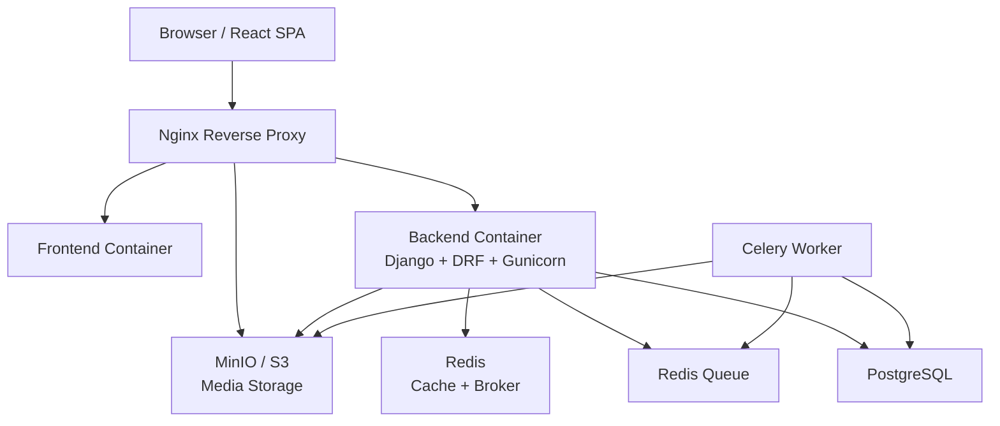

# 🎵 Music Stream App


A full-stack, dockerized music streaming application built as a professional
portfolio project.

The project demonstrates real-world backend development, frontend development,
Docker, testing, CI/CD, production hardening, caching, background jobs, object
storage, and deployment preparation.

---

## 🚧 Project Status

🟡 **Phase 5 in progress — Deployment & Cloud.**

Current roadmap position:

```text
Phase 1: Backend Foundation        ✅ Done
Phase 2: Backend Hardening         ✅ Done
Phase 3: Frontend                  ✅ Done
Phase 4: Integration & Production  ✅ Done
Phase 5: Deployment & Cloud        🟡 In Progress
```

Phase 5 progress:

```text
Day 38 → VPS setup                  ✅ Done
Day 39 → Manual VPS deploy          ✅ Done
Day 40 → Domain + HTTPS             ⏭️ Next
Day 41 → CI/CD auto-deploy
Day 42 → Monitoring + logging
Day 43 → Backups
Day 44 → AWS/cloud migration intro
Day 45 → Final demo prep
```

---

## ✨ Features

- [x] User registration
- [x] JWT login and token refresh
- [x] Protected routes on the frontend
- [x] Upload songs
- [x] Stream/play songs
- [x] HTTP Range request support for seeking audio
- [x] Song list and search
- [x] Public feed
- [x] User profile page
- [x] Public user profile pages
- [x] Background audio processing with Celery
- [x] Audio metadata extraction
- [x] Object storage with MinIO locally and S3-compatible storage in production
- [x] PostgreSQL database
- [x] Redis cache and Celery broker
- [x] Dockerized development environment
- [x] Dockerized production-like environment
- [x] Nginx reverse proxy
- [x] OpenAPI schema, Swagger UI, and Redoc
- [x] Versioned REST API under `/api/v1/`
- [x] Automated backend tests with pytest
- [x] Automated frontend tests with Vitest and React Testing Library
- [x] GitHub Actions CI
- [x] Environment and secrets management
- [x] Production smoke test script
- [x] Security pass: CORS, headers, rate limiting
- [x] Performance pass: query optimization and caching
- [x] Documentation polish with architecture diagrams
- [x] VPS setup preparation: server hardening, Docker, firewall
- [x] Manual VPS deployment (HTTP, port 80)
- [ ] Live VPS deployment
- [ ] Domain + HTTPS
- [ ] Monitoring and backups
- [ ] Playlists
- [ ] Favorite/liked songs

---

## 🛠️ Tech Stack

| Layer | Technology |
|---|---|
| Backend | Django, Django REST Framework |
| Frontend | React, TypeScript, Vite |
| API Client | Axios |
| Routing | React Router |
| Frontend State / Data | React Context, TanStack Query |
| Database | PostgreSQL |
| Cache | Redis |
| Background Jobs | Celery |
| Broker | Redis |
| Storage | MinIO locally, S3-compatible storage in production |
| Reverse Proxy | Nginx |
| Authentication | JWT with SimpleJWT |
| API Docs | drf-spectacular, OpenAPI, Swagger, Redoc |
| Testing | pytest, pytest-cov, Vitest, React Testing Library |
| Linting / Formatting | Ruff, ESLint, Prettier |
| Containerization | Docker, Docker Compose |
| CI/CD | GitHub Actions |
| Deployment Target | VPS first, cloud later |

---

## 📐 Architecture



Nginx is the public entrypoint. It routes frontend requests, API requests, and
media streaming requests. Backend services such as PostgreSQL, Redis, Celery,
and MinIO are internal services in the Docker network.

For the full architecture documentation, see:

👉 [`docs/ARCHITECTURE.md`](./docs/ARCHITECTURE.md)

---

## 🔁 Main Request Flows

### Authentication

```text
Browser
  → Nginx
  → Django API
  → Redis throttle check
  → PostgreSQL user verification
  → JWT access + refresh tokens
```

### Song Upload

```text
Browser
  → Nginx
  → Django API
  → MinIO/S3 stores audio file
  → PostgreSQL stores song row
  → Celery task is queued
  → Celery extracts metadata
```

### Song Streaming

```text
Browser audio player
  → Nginx
  → MinIO/S3 media object
  → HTTP 200 / 206 response
```

### Cached Feed

```text
GET /api/v1/feed/
  → Check Redis cache
  → If hit: return cached response
  → If miss: query PostgreSQL, cache response, return response
```

---

## 📁 Project Structure

```text
music-stream-app/
├── backend/
│   ├── config/
│   │   ├── settings/
│   │   │   ├── base.py
│   │   │   ├── dev.py
│   │   │   ├── ci.py
│   │   │   └── production.py
│   │   ├── urls.py
│   │   └── celery.py
│   ├── music/
│   │   ├── models.py
│   │   ├── serializers.py
│   │   ├── views.py
│   │   ├── tasks.py
│   │   ├── throttles.py
│   │   └── tests/
│   ├── Dockerfile
│   ├── pyproject.toml
│   └── README.md
├── frontend/
│   ├── src/
│   │   ├── api/
│   │   ├── components/
│   │   ├── context/
│   │   ├── hooks/
│   │   ├── pages/
│   │   ├── routes/
│   │   ├── types/
│   │   └── utils/
│   ├── Dockerfile
│   ├── package.json
│   └── README.md
├── nginx/
│   └── nginx.conf
├── scripts/
│   ├── check-env.sh
│   ├── deploy.sh
│   ├── generate-secrets.sh
│   ├── server-setup.sh
│   └── smoke-prod.sh
├── docs/
│   ├── ARCHITECTURE.md
│   ├── DEPLOYMENT.md
│   ├── env-management.md
│   ├── performance.md
│   ├── security.md
│   ├── smoke-tests.md
│   └── JOURNAL.md
├── docker-compose.yml
├── docker-compose.dev.yml
├── docker-compose.prod.yml
├── docker-compose.vps.yml
├── Makefile
└── README.md
```

---

## 🚀 Quick Start — Development

### 1. Clone the project

```bash
git clone https://github.com/Rasoulsa/music-stream-app.git
cd music-stream-app
```

### 2. Create local environment files

The Docker development stack uses `.env.dev`.

```bash
cp .env.dev.example .env.dev
```

Optional: if you also want a generic local `.env` file, create it from the
example:

```bash
cp .env.example .env
```

Optional: if you want to run the frontend directly with `npm run dev`, create a
frontend env file too:

```bash
cp frontend/.env.example frontend/.env
```

Edit the files if needed.

### 3. Start the development stack

```bash
make dev-up-d
```

### 4. Run migrations

```bash
make dev-migrate
```

### 5. Create a superuser, optional

```bash
make dev-createsuperuser
```

### 6. Open the app

Depending on your Docker Compose port configuration:

| Service | URL |
|---|---|
| Frontend | `http://localhost:5173` |
| Backend health | `http://localhost:8000/api/health/` |
| Swagger UI | `http://localhost:8000/api/docs/` |
| Redoc | `http://localhost:8000/api/redoc/` |
| MinIO Console | local development only, if exposed |

---

## 🏭 Production-like Local Stack

The production-like stack runs behind Nginx and uses production settings.

### 1. Prepare production env

The production-like Docker stack uses `.env.prod`.

```bash
cp .env.prod.example .env.prod
```

Generate strong secrets:

```bash
make secrets
```

Paste the generated values into `.env.prod`.

### 2. Validate environment

```bash
make check-env
```

### 3. Start production stack

```bash
make prod-up
```

### 4. Check services

```bash
make prod-ps
```

### 5. Run production smoke test

```bash
make smoke-prod
```

Expected result:

```text
Results: 52 passed, 0 failed
```

---

## 🚢 Deployment

See [`docs/deployment.md`](./docs/deployment.md) for VPS setup and deployment
steps.

Phase 5, Deployment & Cloud, is in progress:

- ✅ Day 38 — VPS setup: server hardening, Docker, firewall
- ✅ Day 39 — Manual VPS deploy
- ⏭️ Day 40 — Domain + HTTPS with Let's Encrypt
- ⬜ Day 41 — CI/CD auto-deploy to VPS
- ⬜ Day 42 — Monitoring and logging basics
- ⬜ Day 43 — Database and media backups
- ⬜ Day 44 — AWS/cloud migration intro
- ⬜ Day 45 — Final demo prep and interview walkthrough

The deployment plan starts with a VPS-based production environment and later
moves toward cloud deployment concepts such as managed storage, managed
databases, monitoring, and automated delivery.

---

## 🧪 Testing

### Backend tests

Run backend tests locally against the disposable test database:

```bash
make test-backend
```

Run backend tests with coverage:

```bash
make test-backend-cov
```

Run backend performance tests:

```bash
make test-backend-perf
```

Run tests inside the development Docker stack:

```bash
make dev-test
make dev-test-cov
```

---

### Frontend tests

```bash
cd frontend
npm install
npm test
```

Build the frontend:

```bash
npm run build
```

Run linting:

```bash
npm run lint
```

---

## 📚 API Reference

The API is versioned under:

```text
/api/v1/
```

The health check is intentionally unversioned:

```text
/api/health/
```

This keeps Docker and Nginx health checks stable even if the API version changes.

---

### Auth endpoints

| Method | Endpoint | Purpose |
|---|---|---|
| `POST` | `/api/v1/auth/register/` | Register a new user |
| `POST` | `/api/v1/auth/login/` | Login and receive JWT tokens |
| `POST` | `/api/v1/auth/refresh/` | Refresh JWT access token |

---

### User endpoints

| Method | Endpoint | Purpose |
|---|---|---|
| `GET` / `PATCH` | `/api/v1/users/me/` | Current user profile |
| `GET` | `/api/v1/users/<username>/` | Public user profile |
| `GET` | `/api/v1/users/<username>/songs/` | Public songs by user |

---

### Song endpoints

| Method | Endpoint | Purpose |
|---|---|---|
| `GET` | `/api/v1/songs/` | List public songs |
| `POST` | `/api/v1/songs/` | Upload a song |
| `GET` | `/api/v1/songs/<id>/` | Retrieve a song |
| `PATCH` | `/api/v1/songs/<id>/` | Update a song |
| `DELETE` | `/api/v1/songs/<id>/` | Delete a song |
| `GET` | `/api/v1/songs/mine/` | List current user's songs |
| `GET` | `/api/v1/feed/` | Public cached feed |

---

### API documentation endpoints

| Endpoint | Purpose |
|---|---|
| `/api/schema/` | OpenAPI schema |
| `/api/docs/` | Swagger UI |
| `/api/redoc/` | Redoc UI |

---

## 🔐 Security Highlights

Security work is documented in:

👉 [`docs/security.md`](./docs/security.md)

Implemented items include:

- `DEBUG=False` in production
- Environment-based secrets
- Git-ignored real env files
- Example env files committed safely
- CORS configuration
- Security headers
- Hidden Nginx version
- JWT authentication
- Login rate limiting
- Registration/upload throttling
- MinIO console not exposed in production
- Production smoke test checks for headers and exposed ports
- VPS setup preparation with firewall and server hardening

---

## ⚡ Performance Highlights

Performance work is documented in:

👉 [`docs/performance.md`](./docs/performance.md)

Implemented items include:

- Feed query optimization
- Redis feed caching
- Database index for public recent songs
- API feed response target under 500ms
- Gzip compression for API responses
- Performance smoke test checks

---

## ✅ Production Smoke Test

The production smoke test validates the full stack:

```bash
make smoke-prod
```

It checks:

- Container health
- Nginx health
- Backend health
- Frontend HTML
- OpenAPI docs
- Auth flow
- JWT login and refresh
- Song upload
- Song retrieval
- Song streaming
- HTTP Range requests
- MinIO internal health
- Security headers
- Environment/secrets setup
- Rate limiting
- Feed performance
- Gzip compression

Documentation:

👉 [`docs/smoke-tests.md`](./docs/smoke-tests.md)

---

## 🧰 Useful Make Commands

```bash
make help
```

Common commands:

| Command | Purpose |
|---|---|
| `make dev-up-d` | Start dev stack in background |
| `make dev-down` | Stop dev stack |
| `make dev-logs` | Follow all dev logs |
| `make dev-migrate` | Run dev migrations |
| `make dev-test-cov` | Run backend tests with coverage in dev |
| `make prod-up` | Start production-like stack |
| `make prod-down` | Stop production-like stack |
| `make prod-logs` | Follow production logs |
| `make prod-check` | Run Django production checks |
| `make check-env` | Validate `.env.prod` |
| `make secrets` | Generate production secrets |
| `make smoke-prod` | Run production smoke test |
| `make test-backend-cov` | Run local backend coverage tests |
| `make test-backend-perf` | Run backend performance tests |
| `make schema-freeze` | Regenerate frozen OpenAPI schema |
| `make schema-check` | Check live schema against frozen schema |

---

## 📖 Documentation

| Document | Purpose |
|---|---|
| [`docs/ARCHITECTURE.md`](./docs/ARCHITECTURE.md) | System diagrams and architecture decisions |
| [`docs/deployment.md`](./docs/deployment.md) | VPS setup and deployment steps |
| [`docs/env-management.md`](./docs/env-management.md) | Environment variables and secrets |
| [`docs/security.md`](./docs/security.md) | Security pass documentation |
| [`docs/performance.md`](./docs/performance.md) | Performance pass documentation |
| [`docs/smoke-tests.md`](./docs/smoke-tests.md) | Production smoke test documentation |
| [`docs/JOURNAL.md`](./docs/JOURNAL.md) | Day-by-day project journal |
| [`backend/README.md`](./backend/README.md) | Backend developer guide |
| [`frontend/README.md`](./frontend/README.md) | Frontend developer guide |
| [`CONTRIBUTING.md`](./CONTRIBUTING.md) | Contribution workflow |

---

## 🧭 Roadmap

### Completed

- [x] Phase 1 — Backend Foundation
- [x] Phase 2 — Backend Hardening
- [x] Phase 3 — Frontend
- [x] Phase 4 — Integration & Production
- [x] Day 38 — VPS setup: server hardening, Docker, firewall
- [x] Day 39 — Manual VPS deploy (HTTP, port 80)

### In Progress

- [ ] Phase 5 — Deployment & Cloud

### Next

- [ ] Day 40 — Domain + HTTPS with Let's Encrypt
- [ ] Day 41 — CI/CD auto-deploy to VPS
- [ ] Day 42 — Monitoring and logging basics
- [ ] Day 43 — Database and media backups
- [ ] Day 44 — AWS/cloud migration intro
- [ ] Day 45 — Final demo prep and interview walkthrough

---

## 🧑‍💻 Interview Talking Points

This project demonstrates:

- Building a production-style REST API with Django and DRF
- Designing a versioned API contract
- Implementing JWT auth for an SPA
- Handling media upload and streaming
- Using object storage instead of container-local media storage
- Running async background jobs with Celery
- Using Redis for both caching and as a broker
- Optimizing a read-heavy feed
- Writing backend and frontend automated tests
- Using Docker Compose for reproducible environments
- Hardening production configuration
- Deploying to a VPS with Docker Compose
- Coexisting with an existing service on the same VPS without port conflicts
- Adding smoke tests for deployment confidence
- Documenting architecture and engineering decisions

---

## 📝 License

This project is licensed under the MIT License.

See:

👉 [`LICENSE`](./LICENSE)
