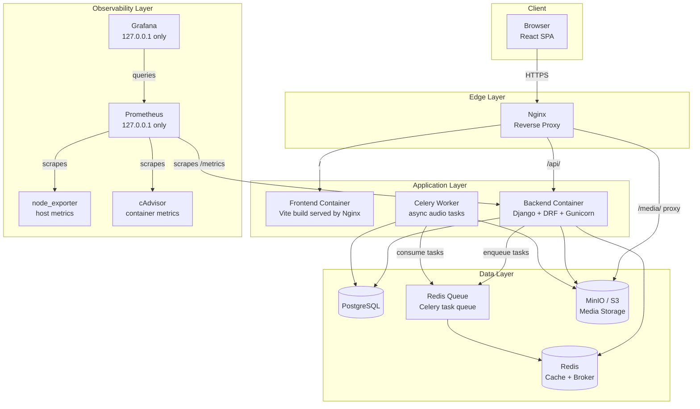
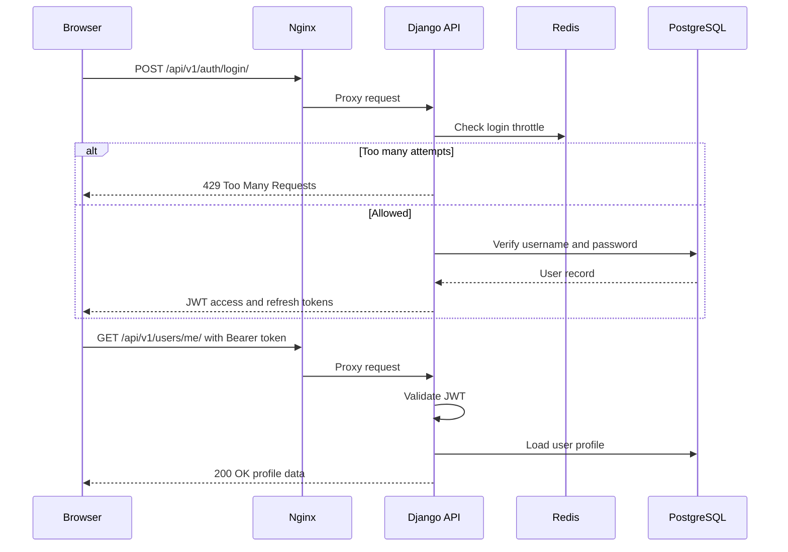
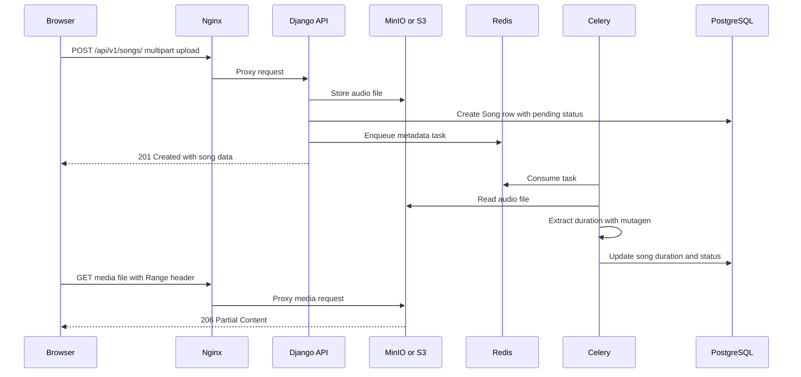
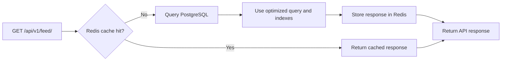
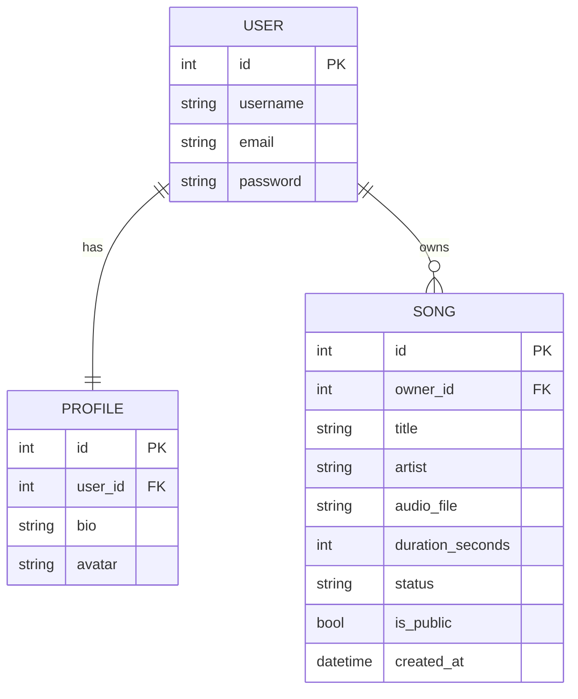
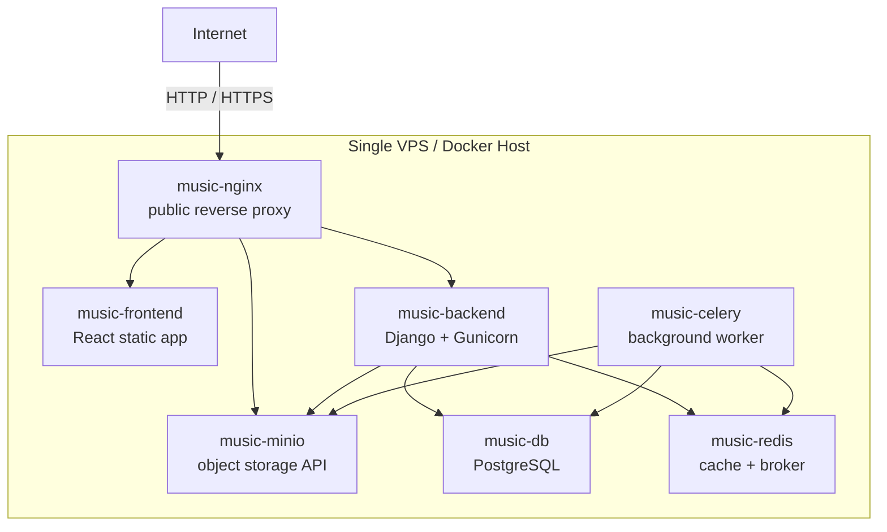
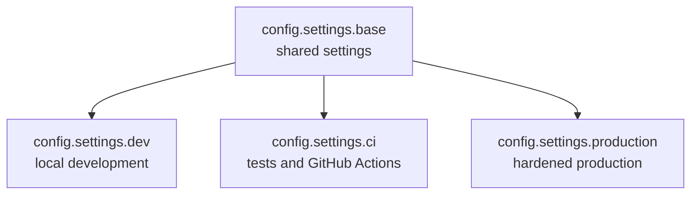
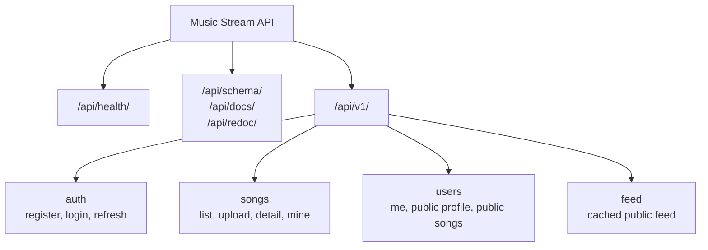
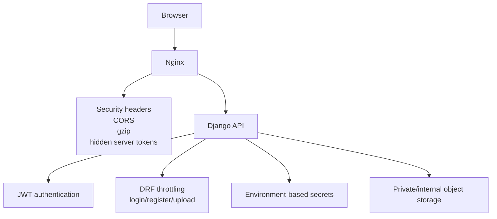

# Architecture — Music Stream App

This document describes the system architecture, request/data flows, and the
key design decisions behind the Music Stream App.

> For the build history and reasoning behind each step, see
> [`JOURNAL.md`](./JOURNAL.md).

---

## 1. System Overview

A full-stack, containerized music streaming platform. Users register, upload
audio files, and stream them with seeking support. The backend exposes a
versioned REST API; the frontend is a React SPA. Nginx is the single public
edge proxy.



**Why a single Nginx edge?**

One public entrypoint simplifies TLS, security headers, gzip, and routing.
The browser only talks to Nginx. Internal services such as PostgreSQL, Redis,
Celery, and MinIO are kept inside the Docker network.

Prometheus scrapes application, host, and container metrics. Prometheus and
Grafana are bound to `127.0.0.1` on the VPS and are accessed through an SSH
tunnel instead of being exposed publicly.

---

## 2. Request Flow — Authentication

JWT-based authentication is handled by Django REST Framework and SimpleJWT.
The login endpoint is rate-limited to reduce brute-force risk.



---

## 3. Request Flow — Upload and Stream

Uploads go to object storage through MinIO/S3. Celery extracts audio metadata
asynchronously. Streaming supports HTTP Range requests so users can seek inside
the audio player.



---

## 4. Feed Caching — Performance

The public feed is read-heavy and is cached in Redis. This reduces database
load and improves response time.



See [`performance.md`](./performance.md) for performance notes.

---

## 5. Data Model



Indexing note: a composite index on public/recent songs supports the public
feed query.

Relevant migration:

```text
backend/music/migrations/0009_song_song_public_recent_idx_and_more.py
```

---

## 6. Production Deployment Topology



Only Nginx is intended to be publicly exposed. Internal services such as
PostgreSQL, Redis, the backend container, Celery, and the MinIO console should
not be exposed directly in production.

The production smoke test verifies important deployment assumptions.

---

## 7. Backend Settings Modules

The backend uses separate settings modules for each environment.



Settings files:

```text
backend/config/settings/
├── base.py
├── dev.py
├── ci.py
└── production.py
```

| Settings module | Purpose |
|---|---|
| `config.settings.base` | Shared Django/DRF configuration |
| `config.settings.dev` | Local development |
| `config.settings.ci` | Automated tests and GitHub Actions |
| `config.settings.production` | Production security, Redis cache, object storage |

---

## 8. API Route Map



Main API routes:

| Endpoint | Purpose |
|---|---|
| `/api/health/` | Health check |
| `/api/schema/` | OpenAPI schema |
| `/api/docs/` | Swagger UI |
| `/api/redoc/` | Redoc UI |
| `/api/v1/auth/register/` | User registration |
| `/api/v1/auth/login/` | JWT login |
| `/api/v1/auth/refresh/` | JWT refresh |
| `/api/v1/songs/` | Song list and upload |
| `/api/v1/songs/mine/` | Current user's songs |
| `/api/v1/feed/` | Public cached feed |
| `/api/v1/users/me/` | Current user's profile |
| `/api/v1/users/<username>/` | Public user profile |
| `/api/v1/users/<username>/songs/` | Public songs by user |

---

## 9. Security Architecture



Security highlights:

- `DEBUG=False` in production
- environment-based secrets
- CORS configuration
- security headers
- hidden Nginx version
- JWT authentication
- login/register/upload throttling
- MinIO console not publicly exposed in production
- smoke test checks security assumptions

See [`security.md`](./security.md).

---

## 10. Key Design Decisions

| Decision | Why |
|---|---|
| Versioned API under `/api/v1/` | Allows future breaking changes without breaking existing clients |
| Unversioned `/api/health/` | Stable health check for Docker, Nginx, and deployment checks |
| JWT authentication | Works well with a React SPA and stateless API design |
| MinIO/S3 object storage | Better fit for uploaded media than container-local disk |
| Celery background worker | Keeps upload requests fast by processing audio metadata asynchronously |
| Redis as broker | Celery uses Redis for task queueing |
| Redis as cache | Improves public feed performance and supports throttling |
| Nginx reverse proxy | Central routing, security headers, gzip, and media proxying |
| Docker Compose | Reproducible dev and production-like environments |
| Split settings modules | Clean separation between dev, CI, and production |
| OpenAPI schema | API contract can be documented and frozen |
| Smoke tests | Confidence that the full production-like stack works end to end |

---

## 11. Related Documentation

- [`env-management.md`](./env-management.md)
- [`security.md`](./security.md)
- [`performance.md`](./performance.md)
- [Monitoring and logging](monitoring.md)
- [`smoke-tests.md`](./smoke-tests.md)
- [`JOURNAL.md`](./JOURNAL.md)
